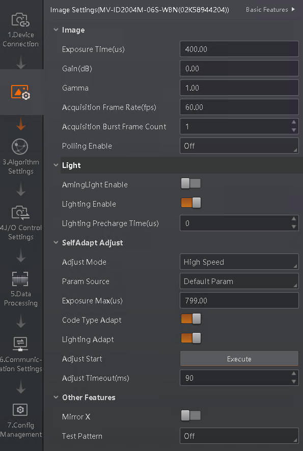
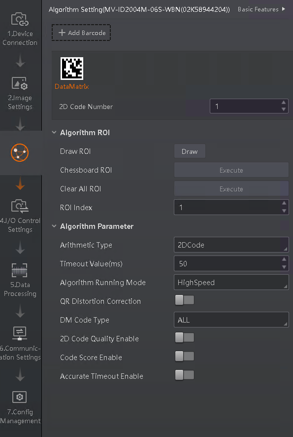
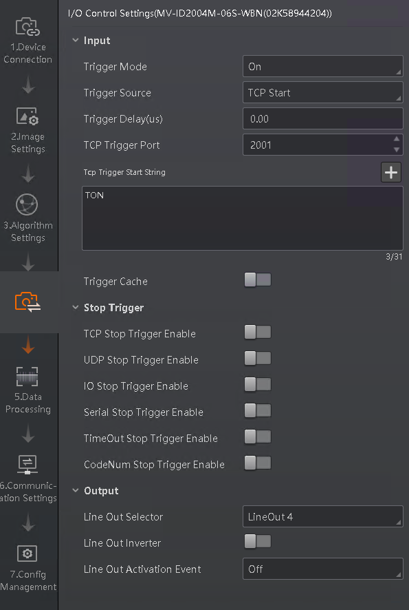
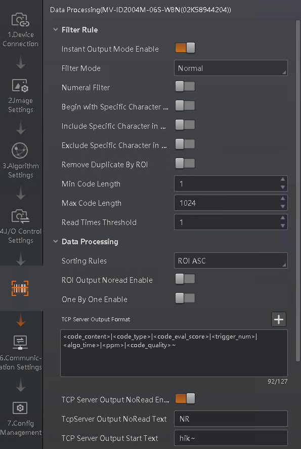
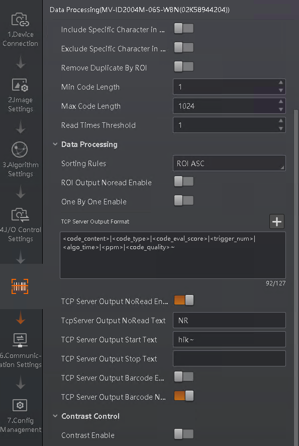
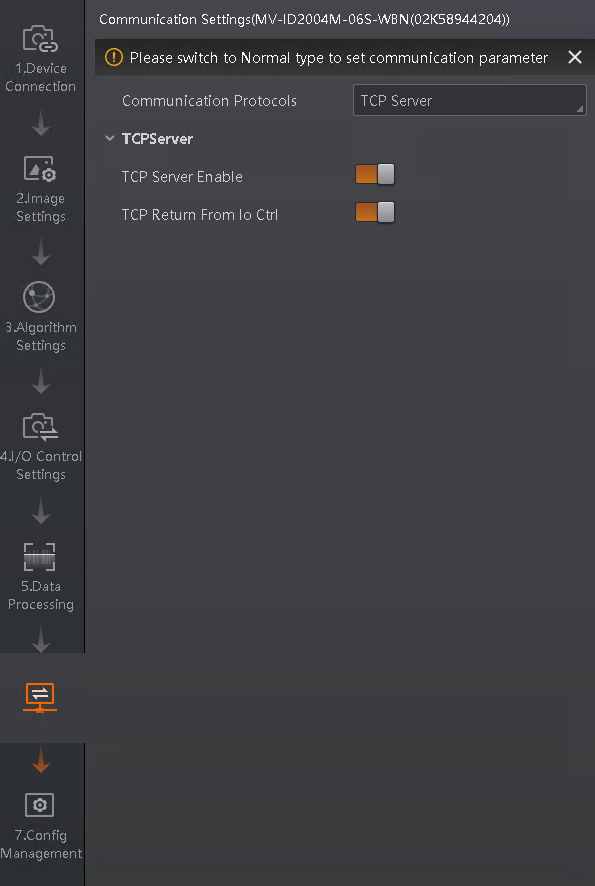

# Цели

Целью тестирования камер было определение сетевых задержек не связанных с временем распознавания кода.

# Условия и методы тестирования

Камеры устанавливались в шоуруме и подключались в сеть промышленного оборудования.

Опрост камер осуществлялся скриптом запускаемым на промышленном компьютере подключенным в тот же коммутатор. В результаты чтения камер добавлен вывод времени, затраченного на распознавание кода.

Под камеры помещен один датаматрикс код и настроен фокус. После тестов определялась задержка по формуле
`(время_получения_ответа - время_отправки_ответа) - время_работы_алгоритма`

<details>
 <summary>Скриншоты настроек IDVMS</summary>








</details>


При проведении теста выключались все протоколы камер, кроме тестируемых. IDVMS отключалась от камеры.

# Результаты тестирования

## MV-ID2004M-06S-WBN

Пинг до камеры

```
sa@show-room-scada:~/BITERP/IIoT/SCADA$ ping 192.168.217.40
PING 192.168.217.40 (192.168.217.40) 56(84) bytes of data.
64 bytes from 192.168.217.40: icmp_seq=1 ttl=64 time=0.666 ms
64 bytes from 192.168.217.40: icmp_seq=2 ttl=64 time=0.420 ms
64 bytes from 192.168.217.40: icmp_seq=3 ttl=64 time=0.710 ms
64 bytes from 192.168.217.40: icmp_seq=4 ttl=64 time=0.964 ms
64 bytes from 192.168.217.40: icmp_seq=5 ttl=64 time=1.02 ms
64 bytes from 192.168.217.40: icmp_seq=6 ttl=64 time=0.826 ms
64 bytes from 192.168.217.40: icmp_seq=7 ttl=64 time=0.834 ms
64 bytes from 192.168.217.40: icmp_seq=8 ttl=64 time=0.599 ms
64 bytes from 192.168.217.40: icmp_seq=9 ttl=64 time=0.848 ms
^C
--- 192.168.217.40 ping statistics ---
9 packets transmitted, 9 received, 0% packet loss, time 8106ms
rtt min/avg/max/mdev = 0.420/0.765/1.022/0.176 ms
```

### Отправка триггера и получение результата по одному и тому же TCP соединению.

* Средняя задержка 53 мс
* Минимальная 44 мс
* Максимальная 63 мс

<details>
 <summary>Лог</summary>

```
sa@show-room-scada:~/BITERP/IIoT/SCADA$ python3 ./camera_read_request.py 
|| 0:00:00.112636 | b'hik~0104810419005987215Pd7p8rMO%PGh\x1d93Wuh4|DataMatrix|0|2904|51|3.4|F\n' ||
|| 0:00:00.092828 | b'hik~0104810419005987215Pd7p8rMO%PGh\x1d93Wuh4|DataMatrix|0|2905|49|3.4|F\n' ||
|| 0:00:00.098787 | b'hik~0104810419005987215Pd7p8rMO%PGh\x1d93Wuh4|DataMatrix|0|2906|47|3.4|F\n' ||
|| 0:00:00.099925 | b'hik~0104810419005987215Pd7p8rMO%PGh\x1d93Wuh4|DataMatrix|0|2907|53|3.4|F\n' ||
|| 0:00:00.111907 | b'hik~0104810419005987215Pd7p8rMO%PGh\x1d93Wuh4|DataMatrix|0|2908|55|3.4|F\n' ||
|| 0:00:00.099853 | b'hik~0104810419005987215Pd7p8rMO%PGh\x1d93Wuh4|DataMatrix|0|2909|51|3.4|F\n' ||
|| 0:00:00.099967 | b'hik~0104810419005987215Pd7p8rMO%PGh\x1d93Wuh4|DataMatrix|0|2910|48|3.4|F\n' ||
|| 0:00:00.099834 | b'hik~0104810419005987215Pd7p8rMO%PGh\x1d93Wuh4|DataMatrix|0|2911|50|3.3|F\n' ||
|| 0:00:00.099910 | b'hik~0104810419005987215Pd7p8rMO%PGh\x1d93Wuh4|DataMatrix|0|2912|46|3.4|F\n' ||
|| 0:00:00.111040 | b'hik~0104810419005987215Pd7p8rMO%PGh\x1d93Wuh4|DataMatrix|0|2913|53|3.4|F\n' ||
|| 0:00:00.099813 | b'hik~0104810419005987215Pd7p8rMO%PGh\x1d93Wuh4|DataMatrix|0|2914|47|3.4|F\n' ||
|| 0:00:00.111880 | b'hik~0104810419005987215Pd7p8rMO%PGh\x1d93Wuh4|DataMatrix|0|2915|50|3.4|F\n' ||
|| 0:00:00.100763 | b'hik~0104810419005987215Pd7p8rMO%PGh\x1d93Wuh4|DataMatrix|0|2916|45|3.3|F\n' ||
|| 0:00:00.100002 | b'hik~0104810419005987215Pd7p8rMO%PGh\x1d93Wuh4|DataMatrix|0|2917|52|3.4|F\n' ||
|| 0:00:00.099790 | b'hik~0104810419005987215Pd7p8rMO%PGh\x1d93Wuh4|DataMatrix|0|2918|48|3.4|F\n' ||
|| 0:00:00.099877 | b'hik~0104810419005987215Pd7p8rMO%PGh\x1d93Wuh4|DataMatrix|0|2919|49|3.4|F\n' ||
|| 0:00:00.099867 | b'hik~0104810419005987215Pd7p8rMO%PGh\x1d93Wuh4|DataMatrix|0|2920|51|3.4|F\n' ||
|| 0:00:00.099937 | b'hik~0104810419005987215Pd7p8rMO%PGh\x1d93Wuh4|DataMatrix|0|2921|49|3.4|F\n' ||
|| 0:00:00.111041 | b'hik~0104810419005987215Pd7p8rMO%PGh\x1d93Wuh4|DataMatrix|0|2922|52|3.3|F\n' ||
|| 0:00:00.110893 | b'hik~0104810419005987215Pd7p8rMO%PGh\x1d93Wuh4|DataMatrix|0|2923|48|3.4|F\n' ||
|| 0:00:00.099799 | b'hik~0104810419005987215Pd7p8rMO%PGh\x1d93Wuh4|DataMatrix|0|2924|47|3.3|F\n' ||
|| 0:00:00.121907 | b'hik~0104810419005987215Pd7p8rMO%PGh\x1d93Wuh4|DataMatrix|0|2925|67|3.4|F\n' ||
|| 0:00:00.112800 | b'hik~0104810419005987215Pd7p8rMO%PGh\x1d93Wuh4|DataMatrix|0|2926|65|3.4|F\n' ||
|| 0:00:00.099904 | b'hik~0104810419005987215Pd7p8rMO%PGh\x1d93Wuh4|DataMatrix|0|2927|50|3.4|F\n' ||
|| 0:00:00.099935 | b'hik~0104810419005987215Pd7p8rMO%PGh\x1d93Wuh4|DataMatrix|0|2928|52|3.4|F\n' ||
|| 0:00:00.099824 | b'hik~0104810419005987215Pd7p8rMO%PGh\x1d93Wuh4|DataMatrix|0|2929|48|3.4|F\n' ||
|| 0:00:00.099937 | b'hik~0104810419005987215Pd7p8rMO%PGh\x1d93Wuh4|DataMatrix|0|2930|45|3.3|F\n' ||
|| 0:00:00.099830 | b'hik~0104810419005987215Pd7p8rMO%PGh\x1d93Wuh4|DataMatrix|0|2931|51|3.4|F\n' ||
|| 0:00:00.099903 | b'hik~0104810419005987215Pd7p8rMO%PGh\x1d93Wuh4|DataMatrix|0|2932|48|3.4|F\n' ||
|| 0:00:00.099967 | b'hik~0104810419005987215Pd7p8rMO%PGh\x1d93Wuh4|DataMatrix|0|2933|46|3.4|F\n' ||
|| 0:00:00.121719 | b'hik~0104810419005987215Pd7p8rMO%PGh\x1d93Wuh4|DataMatrix|0|2934|69|3.3|F\n' ||
|| 0:00:00.112024 | b'hik~0104810419005987215Pd7p8rMO%PGh\x1d93Wuh4|DataMatrix|0|2935|49|3.4|F\n' ||
|| 0:00:00.091876 | b'hik~0104810419005987215Pd7p8rMO%PGh\x1d93Wuh4|DataMatrix|0|2936|46|3.4|F\n' ||
|| 0:00:00.087871 | b'hik~0104810419005987215Pd7p8rMO%PGh\x1d93Wuh4|DataMatrix|0|2937|42|3.4|F\n' ||
|| 0:00:00.110808 | b'hik~0104810419005987215Pd7p8rMO%PGh\x1d93Wuh4|DataMatrix|0|2938|53|3.4|F\n' ||
|| 0:00:00.121844 | b'hik~0104810419005987215Pd7p8rMO%PGh\x1d93Wuh4|DataMatrix|0|2939|69|3.4|F\n' ||
|| 0:00:00.100044 | b'hik~0104810419005987215Pd7p8rMO%PGh\x1d93Wuh4|DataMatrix|0|2940|50|3.4|F\n' ||
|| 0:00:00.099728 | b'hik~0104810419005987215Pd7p8rMO%PGh\x1d93Wuh4|DataMatrix|0|2941|47|3.4|F\n' ||
|| 0:00:00.099931 | b'hik~0104810419005987215Pd7p8rMO%PGh\x1d93Wuh4|DataMatrix|0|2942|51|3.4|F\n' ||
|| 0:00:00.099898 | b'hik~0104810419005987215Pd7p8rMO%PGh\x1d93Wuh4|DataMatrix|0|2943|48|3.4|F\n' ||
|| 0:00:00.099869 | b'hik~0104810419005987215Pd7p8rMO%PGh\x1d93Wuh4|DataMatrix|0|2944|48|3.4|F\n' ||
|| 0:00:00.099807 | b'hik~0104810419005987215Pd7p8rMO%PGh\x1d93Wuh4|DataMatrix|0|2945|45|3.4|F\n' ||
|| 0:00:00.111183 | b'hik~0104810419005987215Pd7p8rMO%PGh\x1d93Wuh4|DataMatrix|0|2946|53|3.4|F\n' ||
|| 0:00:00.100588 | b'hik~0104810419005987215Pd7p8rMO%PGh\x1d93Wuh4|DataMatrix|0|2947|53|3.4|F\n' ||
|| 0:00:00.099981 | b'hik~0104810419005987215Pd7p8rMO%PGh\x1d93Wuh4|DataMatrix|0|2948|48|3.4|F\n' ||
|| 0:00:00.099818 | b'hik~0104810419005987215Pd7p8rMO%PGh\x1d93Wuh4|DataMatrix|0|2949|46|3.4|F\n' ||
|| 0:00:00.099837 | b'hik~0104810419005987215Pd7p8rMO%PGh\x1d93Wuh4|DataMatrix|0|2950|53|3.3|F\n' ||
```
</details>

### Отправка триггера и получение результата по разным TCP соединениям.

* Средняя задержка 55 мс
* Минимальная 33 мс
* Максимальная 94 мс

<details>
 <summary>Лог</summary>

```
sa@show-room-scada:~/BITERP/IIoT/SCADA$ python3 ./camera_read_request.py 
|| 0:00:00.128190 | b'hik~0104810419005987215Pd7p8rMO%PGh\x1d93Wuh4|DataMatrix|0|2955|53|3.4|F\n' ||
|| 0:00:00.091700 | b'hik~0104810419005987215Pd7p8rMO%PGh\x1d93Wuh4|DataMatrix|0|2956|49|3.3|F\n' ||
|| 0:00:00.098906 | b'hik~0104810419005987215Pd7p8rMO%PGh\x1d93Wuh4|DataMatrix|0|2957|46|3.4|F\n' ||
|| 0:00:00.099943 | b'hik~0104810419005987215Pd7p8rMO%PGh\x1d93Wuh4|DataMatrix|0|2958|45|3.4|F\n' ||
|| 0:00:00.099858 | b'hik~0104810419005987215Pd7p8rMO%PGh\x1d93Wuh4|DataMatrix|0|2959|52|3.4|F\n' ||
|| 0:00:00.100074 | b'hik~0104810419005987215Pd7p8rMO%PGh\x1d93Wuh4|DataMatrix|0|2960|50|3.3|F\n' ||
|| 0:00:00.100561 | b'hik~0104810419005987215Pd7p8rMO%PGh\x1d93Wuh4|DataMatrix|0|2961|48|3.4|F\n' ||
|| 0:00:00.099832 | b'hik~0104810419005987215Pd7p8rMO%PGh\x1d93Wuh4|DataMatrix|0|2962|48|3.4|F\n' ||
|| 0:00:00.111051 | b'hik~0104810419005987215Pd7p8rMO%PGh\x1d93Wuh4|DataMatrix|0|2963|56|3.3|F\n' ||
|| 0:00:00.099906 | b'hik~0104810419005987215Pd7p8rMO%PGh\x1d93Wuh4|DataMatrix|0|2964|48|3.4|F\n' ||
|| 0:00:00.099846 | b'hik~0104810419005987215Pd7p8rMO%PGh\x1d93Wuh4|DataMatrix|0|2965|47|3.4|F\n' ||
|| 0:00:00.110885 | b'hik~0104810419005987215Pd7p8rMO%PGh\x1d93Wuh4|DataMatrix|0|2966|52|3.4|F\n' ||
|| 0:00:00.110972 | b'hik~0104810419005987215Pd7p8rMO%PGh\x1d93Wuh4|DataMatrix|0|2967|48|3.3|F\n' ||
|| 0:00:00.091878 | b'hik~0104810419005987215Pd7p8rMO%PGh\x1d93Wuh4|DataMatrix|0|2968|46|3.4|F\n' ||
|| 0:00:00.098780 | b'hik~0104810419005987215Pd7p8rMO%PGh\x1d93Wuh4|DataMatrix|0|2969|47|3.4|F\n' ||
|| 0:00:00.099877 | b'hik~0104810419005987215Pd7p8rMO%PGh\x1d93Wuh4|DataMatrix|0|2970|50|3.4|F\n' ||
|| 0:00:00.099891 | b'hik~0104810419005987215Pd7p8rMO%PGh\x1d93Wuh4|DataMatrix|0|2971|52|3.3|F\n' ||
|| 0:00:00.099927 | b'hik~0104810419005987215Pd7p8rMO%PGh\x1d93Wuh4|DataMatrix|0|2972|46|3.4|F\n' ||
|| 0:00:00.121808 | b'hik~0104810419005987215Pd7p8rMO%PGh\x1d93Wuh4|DataMatrix|0|2973|71|3.4|F\n' ||
|| 0:00:00.110817 | b'hik~0104810419005987215Pd7p8rMO%PGh\x1d93Wuh4|DataMatrix|0|2974|51|3.3|F\n' ||
|| 0:00:00.111983 | b'hik~0104810419005987215Pd7p8rMO%PGh\x1d93Wuh4|DataMatrix|0|2975|52|3.4|F\n' ||
|| 0:00:00.100095 | b'hik~0104810419005987215Pd7p8rMO%PGh\x1d93Wuh4|DataMatrix|0|2976|47|3.3|F\n' ||
|| 0:00:00.125720 | b'hik~0104810419005987215Pd7p8rMO%PGh\x1d93Wuh4|DataMatrix|0|2977|70|3.4|F\n' ||
|| 0:00:00.143777 | b'hik~0104810419005987215Pd7p8rMO%PGh\x1d93Wuh4|DataMatrix|0|2978|64|3.4|F\n' ||
|| 0:00:00.099845 | b'hik~0104810419005987215Pd7p8rMO%PGh\x1d93Wuh4|DataMatrix|0|2979|53|3.4|F\n' ||
|| 0:00:00.099849 | b'hik~0104810419005987215Pd7p8rMO%PGh\x1d93Wuh4|DataMatrix|0|2980|48|3.4|F\n' ||
|| 0:00:00.099809 | b'hik~0104810419005987215Pd7p8rMO%PGh\x1d93Wuh4|DataMatrix|0|2981|44|3.4|F\n' ||
|| 0:00:00.099907 | b'hik~0104810419005987215Pd7p8rMO%PGh\x1d93Wuh4|DataMatrix|0|2982|49|3.4|F\n' ||
|| 0:00:00.100041 | b'hik~0104810419005987215Pd7p8rMO%PGh\x1d93Wuh4|DataMatrix|0|2983|42|3.4|F\n' ||
|| 0:00:00.110793 | b'hik~0104810419005987215Pd7p8rMO%PGh\x1d93Wuh4|DataMatrix|0|2984|53|3.4|F\n' ||
|| 0:00:00.112840 | b'hik~0104810419005987215Pd7p8rMO%PGh\x1d93Wuh4|DataMatrix|0|2985|66|3.4|F\n' ||
|| 0:00:00.088816 | b'hik~0104810419005987215Pd7p8rMO%PGh\x1d93Wuh4|DataMatrix|0|2986|47|3.4|F\n' ||
|| 0:00:00.099819 | b'hik~0104810419005987215Pd7p8rMO%PGh\x1d93Wuh4|DataMatrix|0|2987|47|3.3|F\n' ||
|| 0:00:00.121940 | b'hik~0104810419005987215Pd7p8rMO%PGh\x1d93Wuh4|DataMatrix|0|2988|68|3.4|F\n' ||
```
</details>

### Отправка триггера по TCP, результат по UDP.

* Средняя задержка 72 мс
* Минимальная 55 мс
* Максимальная 86 мс

<details>
 <summary>Лог</summary>

```
sa@show-room-scada:~/BITERP/IIoT/SCADA$ python3 ./camera_read_request.py 
|| 0:00:00.111090 | (b'hik~0104810419005987215Pd7p8rMO%PGh\x1d93Wuh4|DataMatrix|0|3007|47|3.4|F\n', ('192.168.217.40', 2020)) ||
|| 0:00:00.110839 | (b'hik~0104810419005987215Pd7p8rMO%PGh\x1d93Wuh4|DataMatrix|0|3008|48|3.3|F\n', ('192.168.217.40', 2020)) ||
|| 0:00:00.132841 | (b'hik~0104810419005987215Pd7p8rMO%PGh\x1d93Wuh4|DataMatrix|0|3009|67|3.4|F\n', ('192.168.217.40', 2020)) ||
|| 0:00:00.131833 | (b'hik~0104810419005987215Pd7p8rMO%PGh\x1d93Wuh4|DataMatrix|0|3010|45|3.3|F\n', ('192.168.217.40', 2020)) ||
|| 0:00:00.110310 | (b'hik~0104810419005987215Pd7p8rMO%PGh\x1d93Wuh4|DataMatrix|0|3011|48|3.4|F\n', ('192.168.217.40', 2020)) ||
|| 0:00:00.111674 | (b'hik~0104810419005987215Pd7p8rMO%PGh\x1d93Wuh4|DataMatrix|0|3012|51|3.3|F\n', ('192.168.217.40', 2020)) ||
|| 0:00:00.131842 | (b'hik~0104810419005987215Pd7p8rMO%PGh\x1d93Wuh4|DataMatrix|0|3013|67|3.3|F\n', ('192.168.217.40', 2020)) ||
|| 0:00:00.131833 | (b'hik~0104810419005987215Pd7p8rMO%PGh\x1d93Wuh4|DataMatrix|0|3014|45|3.3|F\n', ('192.168.217.40', 2020)) ||
|| 0:00:00.111019 | (b'hik~0104810419005987215Pd7p8rMO%PGh\x1d93Wuh4|DataMatrix|0|3015|48|3.4|F\n', ('192.168.217.40', 2020)) ||
|| 0:00:00.109832 | (b'hik~0104810419005987215Pd7p8rMO%PGh\x1d93Wuh4|DataMatrix|0|3016|64|3.3|F\n', ('192.168.217.40', 2020)) ||
|| 0:00:00.132831 | (b'hik~0104810419005987215Pd7p8rMO%PGh\x1d93Wuh4|DataMatrix|0|3017|75|3.4|F\n', ('192.168.217.40', 2020)) ||
|| 0:00:00.131885 | (b'hik~0104810419005987215Pd7p8rMO%PGh\x1d93Wuh4|DataMatrix|0|3018|50|3.4|F\n', ('192.168.217.40', 2020)) ||
```
</details>

## MV-ID3016PM-06M-WBN
### Отправка триггера и получение результата по одному и тому же TCP соединению.

* Средняя задержка 46 мс
* Минимальная 36 мс
* Максимальная 62 мс

<details>
 <summary>Лог</summary>

```
|| 0:00:00.080907 | b'hik~0104810419005987215PJ-IA9B!dIHt\x1d93u87q|DataMatrix|0|4|19|4.1|F\n' ||
|| 0:00:00.066389 | b'hik~0104810419005987215PJ-IA9B!dIHt\x1d93u87q|DataMatrix|0|5|24|4.1|F\n' ||
|| 0:00:00.065777 | b'hik~0104810419005987215PJ-IA9B!dIHt\x1d93u87q|DataMatrix|0|6|19|4.0|F\n' ||
|| 0:00:00.064960 | b'hik~0104810419005987215PJ-IA9B!dIHt\x1d93u87q|DataMatrix|0|7|19|4.1|F\n' ||
|| 0:00:00.066086 | b'hik~0104810419005987215PJ-IA9B!dIHt\x1d93u87q|DataMatrix|0|8|20|4.0|F\n' ||
|| 0:00:00.065718 | b'hik~0104810419005987215PJ-IA9B!dIHt\x1d93u87q|DataMatrix|0|9|20|4.1|F\n' ||
|| 0:00:00.065943 | b'hik~0104810419005987215PJ-IA9B!dIHt\x1d93u87q|DataMatrix|0|10|19|4.0|F\n' ||
|| 0:00:00.065755 | b'hik~0104810419005987215PJ-IA9B!dIHt\x1d93u87q|DataMatrix|0|11|19|4.0|F\n' ||
|| 0:00:00.065979 | b'hik~0104810419005987215PJ-IA9B!dIHt\x1d93u87q|DataMatrix|0|12|19|4.1|F\n' ||
|| 0:00:00.065930 | b'hik~0104810419005987215PJ-IA9B!dIHt\x1d93u87q|DataMatrix|0|13|19|4.0|F\n' ||
|| 0:00:00.065813 | b'hik~0104810419005987215PJ-IA9B!dIHt\x1d93u87q|DataMatrix|0|14|19|4.1|F\n' ||
|| 0:00:00.065979 | b'hik~0104810419005987215PJ-IA9B!dIHt\x1d93u87q|DataMatrix|0|15|19|4.1|F\n' ||
|| 0:00:00.064887 | b'hik~0104810419005987215PJ-IA9B!dIHt\x1d93u87q|DataMatrix|0|16|19|4.1|F\n' ||
|| 0:00:00.054898 | b'hik~0104810419005987215PJ-IA9B!dIHt\x1d93u87q|DataMatrix|0|17|19|4.0|F\n' ||
|| 0:00:00.064837 | b'hik~0104810419005987215PJ-IA9B!dIHt\x1d93u87q|DataMatrix|0|18|19|4.1|F\n' ||
|| 0:00:00.054945 | b'hik~0104810419005987215PJ-IA9B!dIHt\x1d93u87q|DataMatrix|0|19|19|4.1|F\n' ||
|| 0:00:00.064857 | b'hik~0104810419005987215PJ-IA9B!dIHt\x1d93u87q|DataMatrix|0|20|19|4.0|F\n' ||
|| 0:00:00.065942 | b'hik~0104810419005987215PJ-IA9B!dIHt\x1d93u87q|DataMatrix|0|21|19|4.1|F\n' ||
|| 0:00:00.054768 | b'hik~0104810419005987215PJ-IA9B!dIHt\x1d93u87q|DataMatrix|0|22|19|4.1|F\n' ||
|| 0:00:00.066008 | b'hik~0104810419005987215PJ-IA9B!dIHt\x1d93u87q|DataMatrix|0|23|19|4.0|F\n' ||
|| 0:00:00.064821 | b'hik~0104810419005987215PJ-IA9B!dIHt\x1d93u87q|DataMatrix|0|24|19|4.1|F\n' ||
|| 0:00:00.054907 | b'hik~0104810419005987215PJ-IA9B!dIHt\x1d93u87q|DataMatrix|0|25|19|4.1|F\n' ||
|| 0:00:00.065889 | b'hik~0104810419005987215PJ-IA9B!dIHt\x1d93u87q|DataMatrix|0|26|19|4.0|F\n' ||
|| 0:00:00.065927 | b'hik~0104810419005987215PJ-IA9B!dIHt\x1d93u87q|DataMatrix|0|27|19|4.1|F\n' ||
|| 0:00:00.065813 | b'hik~0104810419005987215PJ-IA9B!dIHt\x1d93u87q|DataMatrix|0|28|19|4.1|F\n' ||
|| 0:00:00.065933 | b'hik~0104810419005987215PJ-IA9B!dIHt\x1d93u87q|DataMatrix|0|29|19|4.1|F\n' ||
|| 0:00:00.065898 | b'hik~0104810419005987215PJ-IA9B!dIHt\x1d93u87q|DataMatrix|0|30|19|4.1|F\n' ||
|| 0:00:00.065878 | b'hik~0104810419005987215PJ-IA9B!dIHt\x1d93u87q|DataMatrix|0|31|19|4.1|F\n' ||
|| 0:00:00.065961 | b'hik~0104810419005987215PJ-IA9B!dIHt\x1d93u87q|DataMatrix|0|32|19|4.1|F\n' ||
|| 0:00:00.065966 | b'hik~0104810419005987215PJ-IA9B!dIHt\x1d93u87q|DataMatrix|0|33|19|4.0|F\n' ||
|| 0:00:00.065699 | b'hik~0104810419005987215PJ-IA9B!dIHt\x1d93u87q|DataMatrix|0|34|20|4.0|F\n' ||
|| 0:00:00.065910 | b'hik~0104810419005987215PJ-IA9B!dIHt\x1d93u87q|DataMatrix|0|35|19|4.1|F\n' ||
|| 0:00:00.065903 | b'hik~0104810419005987215PJ-IA9B!dIHt\x1d93u87q|DataMatrix|0|36|19|4.1|F\n' ||
|| 0:00:00.065888 | b'hik~0104810419005987215PJ-IA9B!dIHt\x1d93u87q|DataMatrix|0|37|20|4.0|F\n' ||
|| 0:00:00.065797 | b'hik~0104810419005987215PJ-IA9B!dIHt\x1d93u87q|DataMatrix|0|38|19|4.1|F\n' ||
|| 0:00:00.065039 | b'hik~0104810419005987215PJ-IA9B!dIHt\x1d93u87q|DataMatrix|0|39|19|4.1|F\n' ||
|| 0:00:00.054760 | b'hik~0104810419005987215PJ-IA9B!dIHt\x1d93u87q|DataMatrix|0|40|19|4.1|F\n' ||
|| 0:00:00.065014 | b'hik~0104810419005987215PJ-IA9B!dIHt\x1d93u87q|DataMatrix|0|41|19|4.1|F\n' ||
|| 0:00:00.054808 | b'hik~0104810419005987215PJ-IA9B!dIHt\x1d93u87q|DataMatrix|0|42|19|4.1|F\n' ||
|| 0:00:00.066019 | b'hik~0104810419005987215PJ-IA9B!dIHt\x1d93u87q|DataMatrix|0|43|19|4.1|F\n' ||
|| 0:00:00.064821 | b'hik~0104810419005987215PJ-IA9B!dIHt\x1d93u87q|DataMatrix|0|44|19|4.1|F\n' ||
|| 0:00:00.054911 | b'hik~0104810419005987215PJ-IA9B!dIHt\x1d93u87q|DataMatrix|0|45|19|4.1|F\n' ||
|| 0:00:00.065797 | b'hik~0104810419005987215PJ-IA9B!dIHt\x1d93u87q|DataMatrix|0|46|19|4.1|F\n' ||
|| 0:00:00.065940 | b'hik~0104810419005987215PJ-IA9B!dIHt\x1d93u87q|DataMatrix|0|47|19|4.0|F\n' ||
|| 0:00:00.065842 | b'hik~0104810419005987215PJ-IA9B!dIHt\x1d93u87q|DataMatrix|0|48|19|4.1|F\n' ||
|| 0:00:00.065935 | b'hik~0104810419005987215PJ-IA9B!dIHt\x1d93u87q|DataMatrix|0|49|19|4.0|F\n' ||
|| 0:00:00.065944 | b'hik~0104810419005987215PJ-IA9B!dIHt\x1d93u87q|DataMatrix|0|50|19|4.0|F\n' ||
|| 0:00:00.065859 | b'hik~0104810419005987215PJ-IA9B!dIHt\x1d93u87q|DataMatrix|0|51|19|4.1|F\n' ||
|| 0:00:00.065912 | b'hik~0104810419005987215PJ-IA9B!dIHt\x1d93u87q|DataMatrix|0|52|19|4.1|F\n' ||
|| 0:00:00.065862 | b'hik~0104810419005987215PJ-IA9B!dIHt\x1d93u87q|DataMatrix|0|53|19|4.1|F\n' ||
|| 0:00:00.065841 | b'hik~0104810419005987215PJ-IA9B!dIHt\x1d93u87q|DataMatrix|0|54|19|4.0|F\n' ||
|| 0:00:00.065894 | b'hik~0104810419005987215PJ-IA9B!dIHt\x1d93u87q|DataMatrix|0|55|19|4.1|F\n' ||
|| 0:00:00.065880 | b'hik~0104810419005987215PJ-IA9B!dIHt\x1d93u87q|DataMatrix|0|56|19|4.1|F\n' ||
|| 0:00:00.064996 | b'hik~0104810419005987215PJ-IA9B!dIHt\x1d93u87q|DataMatrix|0|57|19|4.1|F\n' ||
|| 0:00:00.054770 | b'hik~0104810419005987215PJ-IA9B!dIHt\x1d93u87q|DataMatrix|0|58|19|4.1|F\n' ||
|| 0:00:00.065949 | b'hik~0104810419005987215PJ-IA9B!dIHt\x1d93u87q|DataMatrix|0|59|19|4.0|F\n' ||
|| 0:00:00.065884 | b'hik~0104810419005987215PJ-IA9B!dIHt\x1d93u87q|DataMatrix|0|60|20|4.1|F\n' ||
|| 0:00:00.065991 | b'hik~0104810419005987215PJ-IA9B!dIHt\x1d93u87q|DataMatrix|0|61|19|4.1|F\n' ||
|| 0:00:00.064823 | b'hik~0104810419005987215PJ-IA9B!dIHt\x1d93u87q|DataMatrix|0|62|19|4.1|F\n' ||
|| 0:00:00.055133 | b'hik~0104810419005987215PJ-IA9B!dIHt\x1d93u87q|DataMatrix|0|63|19|4.1|F\n' ||
|| 0:00:00.065620 | b'hik~0104810419005987215PJ-IA9B!dIHt\x1d93u87q|DataMatrix|0|64|19|4.0|F\n' ||
|| 0:00:00.065939 | b'hik~0104810419005987215PJ-IA9B!dIHt\x1d93u87q|DataMatrix|0|65|19|4.1|F\n' ||
|| 0:00:00.065855 | b'hik~0104810419005987215PJ-IA9B!dIHt\x1d93u87q|DataMatrix|0|66|19|4.1|F\n' ||
|| 0:00:00.065911 | b'hik~0104810419005987215PJ-IA9B!dIHt\x1d93u87q|DataMatrix|0|67|19|4.0|F\n' ||
|| 0:00:00.065906 | b'hik~0104810419005987215PJ-IA9B!dIHt\x1d93u87q|DataMatrix|0|68|19|4.1|F\n' ||
|| 0:00:00.065832 | b'hik~0104810419005987215PJ-IA9B!dIHt\x1d93u87q|DataMatrix|0|69|19|4.1|F\n' ||
|| 0:00:00.065976 | b'hik~0104810419005987215PJ-IA9B!dIHt\x1d93u87q|DataMatrix|0|70|19|4.1|F\n' ||
|| 0:00:00.065855 | b'hik~0104810419005987215PJ-IA9B!dIHt\x1d93u87q|DataMatrix|0|71|19|4.1|F\n' ||
```
</details>

